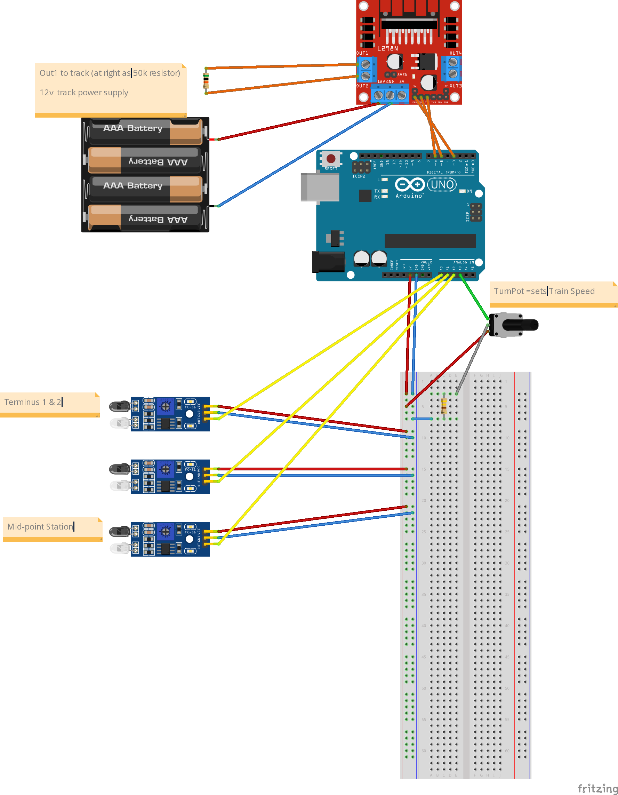

# A Simple Reversing Train Controller with Adrino

## Overview

A two-terminus track with a station midway, controlled with Arduino: auto-reverse employing IR proximity sensors.

This is a fork of DIY Jimmy's "Three Station Railroad Arduino Demo", however, that project is setup as ArduinoIDE and I prefer vanilla C/C++ or JavaScript with Microsoft VSCode etc. Plus, that code can be refactored for me, a n00b to Arduinios and very rusty with C++. That said, this compiles fine using [Arduino IDE 2.x](https://www.arduino.cc/en/software) (`Arduino Automated Railroad.ino` becomes `src/main.cpp`).

[Original GitHub Source](https://github.com/DIYandDigitalRR/arduino-automated-railroad) and his incredibly helpful [YouTube tutorial](https://youtu.be/PoOxFS2DNpI?si=a4vY9Ln4eqhzoHmL). Find him at [DIY and Digital Railroad](https://www.diyanddigitalrr.com/)

### Notes:

* my final build uses a ease-in stop at the middle station rather than merely cutting the power, but I wanted to leave this "pure" and of a piece with Jimmy's original example.
* any guage/scale layout: O, HO, N -- code should be scale agnostic
* the motor driver used here can control TWO DC tracks... makes ya think, don't it?

### Key Electronics

* 3 **IR proximity sensors**, detect when train "arrives" at a station
* **potentiometer**, control train speed
* **Motor Driver**, applying current allows us to electrify either track (forward & reverse), as well as set the speed (using potentiometer's value)
* **Arduino Uno & breadboard** (this probably fits easily on smaller mini, but I had an Uno handy)

Direction of travel -- "Left" or "Right", "Forward" or "Reverse" -- are completely arbitrary, so pick and move on.

## Circuit Diagram

(check the "docs/fritzing" directory for the Wiring Diagram and additional part definition (found on very helpful Fritzing forums)

## Build

* solder parts, no jumpers
* mount IR sensors beneath the flextrack, drill small holes in ties for LED & reciever

## Resources

I'll be using an [n-scale Bachmann Trolley](https://www.modeltrainstuff.com/bachmann-n-61089-brill-trolley-orange-cream/) (trolleys can be found for as little as $35-$60)

### My Dev Setup

Everything is free except Copilot, which is optional, but helpful (even explains pin-outs)

* [Visual Studio Code](https://code.visualstudio.com/download), with extensions:
    * [PlatformIO](https://platformio.org/)
    * Copilot
* [Arduino CLI](https://arduino.github.io/arduino-cli/0.19/)
* [Gnu Compiler Collection C++ Compiler](https://gcc.gnu.org/install/download.html)
* [Fitzring](https://fritzing.org/download/) circuit boarding & layout software 😍

### Jimmy's Parts List

* [Kato Pocket Line Tram](https://shorturl.at/hkKVY)
* [Arduino UNO](https://amzn.to/3jTbDJ4)
* [L298N Motor Driver](https://amzn.to/3EuMgVJ)
* [Infrared Sensors](https://amzn.to/3nIqsPD)
* [Resistor](https://amzn.to/3CBtPxS)
* [Rotary Potentiometer](https://amzn.to/3mwkIZN)
* [Wires](https://amzn.to/3GwYFtY)
* [Breadboard](https://amzn.to/3w0KIjg)
* [Power Supply](https://amzn.to/3jSOkPx)
* [Barrell Plug Adapter](https://amzn.to/31j3Iya)
